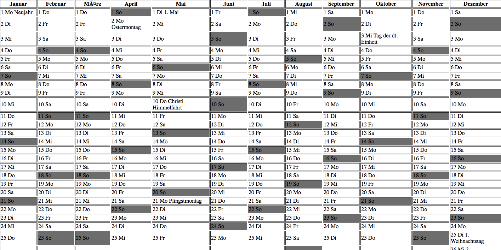

# German Version of year calendar

German actual year calendar with all bank holidays with use of date/time functions.

To see the live version of the app, open the calendar.php file on your localhost, for example using XAMPP.

